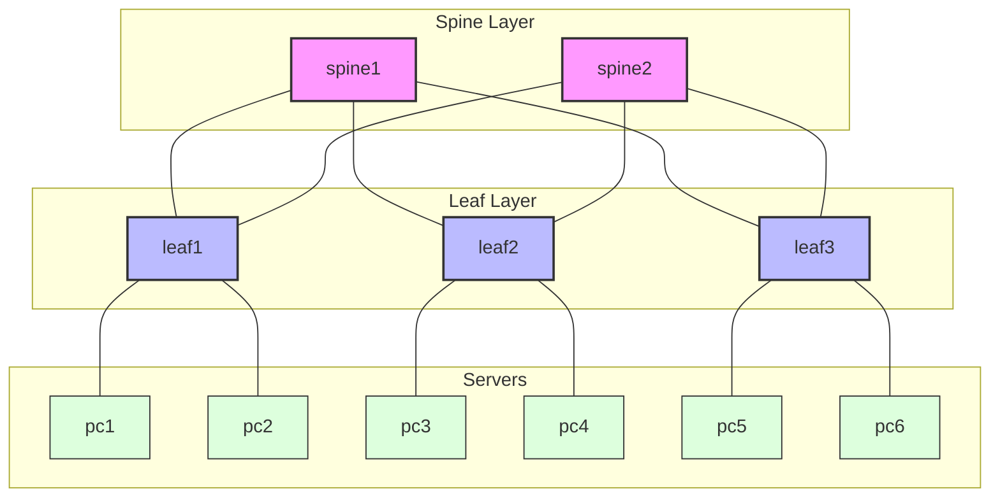

# My Ansible Lab - SR Linux Network Automation

A comprehensive lab environment for learning and testing Nokia SR Linux network automation using Ansible and Containerlab. This project demonstrates modern, model-driven network configuration using YANG models and implements a data-driven approach for scalable infrastructure-as-code.

## Table of Contents

- [Overview](#overview)
- [Architecture](#architecture)
- [Technology Stack](#technology-stack)
- [Containerlab Topology](#containerlab-topology)
- [Project Structure](#project-structure)
- [Installation and Setup](#installation-and-setup)
- [Configuration Approach](#configuration-approach)
- [Playbook Documentation](#playbook-documentation)
- [Verification](#verification)
- [Troubleshooting](#troubleshooting)
- [Future Enhancements](#future-enhancements)

## Overview

This lab provides a hands-on environment for network engineers to learn and practice:

- **Containerlab deployment** - Lightweight network topology simulation
- **Nokia SR Linux automation** - Using Ansible with JSON-RPC API
- **Model-driven configuration** - YANG-based network management
- **Data-driven design** - Separation of logic and data for maintainability
- **Infrastructure as Code** - Version-controlled network configurations

## Architecture

## Architecture

The lab implements a Spine-Leaf network topology with 2 Spines and 3 Leaves, connecting 6 PC endpoints.



**Design considerations:**
- **Spine Layer**: 2 x Nokia SR Linux (Aggregators)
- **Leaf Layer**: 3 x Nokia SR Linux (Access)
- **Hosts**: 6 x Alpine Linux (Web Servers)
- **Underlay**: IS-IS routing with IPv4 Point-to-Point links (/31)
- **Overlay**: Prepared for BGP EVPN (Future)

## Technology Stack

| Component | Technology | Role |
|-----------|------------|------|
| **Network OS** | Nokia SR Linux | Spine/Leaf Switches |
| **Servers** | Alpine Linux + Nginx | Web Endpoints |
| **Automation** | Ansible 2.9+ | Config Management |
| **Topology** | Containerlab | Infrastructure Orchestrator |

## Containerlab Topology

The topology definition at [`labs/myfabric01/myfabric01.clab.yml`](file:///d:/my-ansible-lab/labs/myfabric01/myfabric01.clab.yml) creates:

**Nodes:**

| Name | Role | Ansible Group | Mgmt IP |
|------|------|---------------|---------|
| `spine1-2` | Backbone | `spine` | 172.200.20.11-12 |
| `leaf1-3` | TOR Switch | `leaf` | 172.200.20.21-23 |
| `pc1-6` | Web Server | `webservers` | 172.200.20.101-106 |

**Connectivity:**
- **Spines <-> Leaves**: Full Mesh eBGP style links
- **Leaves <-> PCs**: VLAN access ports (VLAN 10/20)

Containerlab automatically generates an Ansible inventory at:
```
labs/myfabric01/clab-myfabric01/ansible-inventory.yml
```

This inventory includes:
- Host entries for each node
- Ansible groups based on labels (`ansible-group: spine`, `ansible-group: leaf`)
- Connection variables (management IP, username, password)

## Project Structure

```
my-ansible-lab/
├── ansible/                      # Ansible working directory
│   ├── ansible.cfg              # Ansible configuration
│   ├── requirements.yml         # Required Ansible collections
│   ├── playbooks/               # Automation playbooks
│   │   ├── site.yml            # Main orchestration playbook
│   │   ├── test_srl.yml        # Connectivity test
│   │   ├── interfaces.yml      # Interface configuration
│   │   ├── routing.yml         # IS-IS underlay configuration
│   │   └── verify_interfaces.yml # Interface verification
│   └── data/                    # Configuration data (data-driven approach)
│       ├── interfaces.yml      # Per-device interface definitions
│       └── routing.yml         # Routing protocol parameters
└── labs/                        # Containerlab topologies
    └── myfabric01/
        └── myfabric01.clab.yml # Topology definition
```

## Installation and Setup

### Prerequisites

- **Docker**: For running containerlab nodes
- **Containerlab**: Network topology orchestration
- **Ansible**: Automation engine (2.9 or later)
- **Python 3**: Ansible runtime dependency

### Step 1: Deploy the Containerlab Topology

Navigate to the topology directory and deploy:

```bash
cd labs/myfabric01
containerlab deploy -t myfabric01.clab.yml
```

This command will:
- Pull the SR Linux container image (if not cached)
- Create the management network
- Start all network nodes
- Configure management IP addresses
- Generate the Ansible inventory file

**Verify deployment:**
```bash
containerlab inspect -t myfabric01.clab.yml
```

### Step 2: Install Ansible

If Ansible is not already installed:

```bash
sudo apt update
sudo apt install ansible -y
```

**Verify installation:**
```bash
ansible --version
```

### Step 3: Install Required Ansible Collections

Install the SR Linux and network common collections:

```bash
cd ansible
ansible-galaxy collection install -r requirements.yml --force
```

**Verify collection installation:**
```bash
ansible-doc -t httpapi nokia.srlinux.srlinux
```

If documentation is displayed, the HttpAPI plugin is correctly installed.

### Step 4: Verify Ansible Inventory

Check that Containerlab generated the inventory correctly:

```bash
ansible-inventory -i ../labs/myfabric01/clab-myfabric01/ansible-inventory.yml --graph
```

**Expected output:**
```
@all:
  |--@spine:
  |  |--clab-myfabric01-spine1
  |  |--clab-myfabric01-spine2
  |--@leaf:
  |  |--clab-myfabric01-leaf1
  |  |--clab-myfabric01-leaf2
  |  |--clab-myfabric01-leaf3
  |--@hosts:
  |  |--clab-myfabric01-pc1
  |  |--...
```

### Step 5: Test SR Linux Connectivity

Run the connectivity test playbook:

```bash
cd ansible
ansible-playbook playbooks/test_srl.yml -vv
```

**Expected result:** Each SR Linux node should return its software version.

## Configuration Approach

### Data-Driven Design

This project separates **logic** (playbooks) from **data** (variable files):

- **Playbooks** (`ansible/playbooks/`) contain reusable automation logic
- **Data files** (`ansible/data/`) contain device-specific configurations
- **Benefits**: 
  - Easy to scale (add new devices by updating data files)
  - Reusable playbooks across different topologies
  - Version-controlled configuration source of truth

### YANG Model-Driven Configuration

SR Linux does **not** use traditional CLI-based automation. Instead:

- Configuration uses **YANG paths** (e.g., `/interface[name=ethernet-1/1]`)
- API interaction via **JSON-RPC** over HTTPS
- Ansible uses the `nokia.srlinux` collection's HttpAPI plugin

### Replace vs Update Operations

The `nokia.srlinux.config` module supports two operations:

| Operation | Behavior | Use Case |
|-----------|----------|----------|
| `replace` | Replaces the entire configuration at the specified path | Leaf nodes (setting specific values) |
| `update` | Merges new configuration with existing | Adding to lists or containers |

**Best Practice:** For most leaf-level configurations (IPs, admin states), use `replace` to ensure idempotency.

## Playbook Documentation

### test_srl.yml - Connectivity Test

**Purpose:** Verify JSON-RPC API connectivity to all SR Linux devices.

**What it does:**
- Connects to each device using HttpAPI
- Retrieves the system software version
- Displays results for verification

**When to use:** 
- After initial lab deployment
- To validate Ansible collection installation
- When troubleshooting connectivity issues

**Run command:**
```bash
ansible-playbook playbooks/test_srl.yml -vv
```

---

### interfaces.yml - Interface Configuration

**Purpose:** Configure loopback and point-to-point interfaces on all devices.

**What it does:**
- Creates loopback interfaces (lo0) with /32 IP addresses
- Configures point-to-point ethernet interfaces with /31 addressing
- Sets interface descriptions for documentation
- Enables interfaces (admin-state: enable)

**Data source:** `ansible/data/interfaces.yml`

**Run command:**
```bash
ansible-playbook playbooks/interfaces.yml
```

---

### routing.yml - IS-IS Underlay Configuration

**Purpose:** Configure IS-IS routing protocol for underlay connectivity.

**What it does:**
- Creates IS-IS instance in the default network-instance
- Configures IS-IS level (level-2 for simplicity)
- Adds loopback interfaces as passive IS-IS interfaces
- Enables IS-IS on all point-to-point links

**Data sources:** 
- `ansible/data/interfaces.yml` (interface names)
- `ansible/data/routing.yml` (IS-IS parameters)

**Run command:**
```bash
ansible-playbook playbooks/routing.yml
```

**Expected result:** IS-IS adjacencies form between spine and leaf nodes.

---

### verify_interfaces.yml - Interface Verification

**Purpose:** Validate that interface configuration was applied correctly.

**What it does:**
- Reads actual interface state from devices
- Asserts that loopback interfaces exist
- Asserts that P2P interfaces exist
- Fails playbook execution if verification fails

**When to use:**
- After running `interfaces.yml`
- To validate configuration changes
- In CI/CD pipelines for automated testing

**Run command:**
```bash
ansible-playbook playbooks/verify_interfaces.yml
```

---

### site.yml - Master Orchestration

**Purpose:** Run all configuration playbooks in the correct order.

**What it does:**
- Imports `interfaces.yml`
- Imports `routing.yml`
- Imports `verify.yml`

**Supports tagging:**
```bash
# Run only interface configuration
ansible-playbook playbooks/site.yml --tags interfaces

# Run only routing configuration
ansible-playbook playbooks/site.yml --tags routing
```

## Verification

### Manual Verification Steps

**1. Check IS-IS Adjacencies:**

Access a spine node:
```bash
docker exec -it clab-myfabric01-spine1 sr_cli
```

Run IS-IS neighbor check:
```
show network-instance default protocols isis adjacency
```

**Expected output:** Active adjacencies to both leaf nodes.

**2. Verify IP Connectivity:**

Check loopback reachability:
```
ping 10.255.0.11 -c 3
ping 10.255.0.12 -c 3
```

**3. Review Running Configuration:**

```
info from running /interface
info from running /network-instance default protocols isis
```

### Automated Verification

Run the verification playbook:
```bash
ansible-playbook playbooks/verify_interfaces.yml
```

## Troubleshooting

### Common Issues

**Issue:** `FAILED! => {"msg": "httpapi connection plugin 'nokia.srlinux.srlinux' not found"}`

**Solution:** Install the nokia.srlinux collection:
```bash
ansible-galaxy collection install nokia.srlinux --force
```

---

**Issue:** `Connection refused` when running playbooks

**Solution:** Verify the lab is running:
```bash
containerlab inspect -t myfabric01.clab.yml
```

Ensure all nodes show `State: running`.

---

**Issue:** `YANG path not found` errors

**Solution:** 
1. Verify correct YANG path syntax (case-sensitive)
2. Check SR Linux documentation for the correct path
3. Use discovery playbook to explore available paths

---

**Issue:** Inventory file not found

**Solution:** Make sure `ansible.cfg` points to the correct inventory path:
```ini
inventory = ../labs/myfabric01/clab-myfabric01/ansible-inventory.yml
```

## Future Enhancements

This lab serves as a foundation for more advanced automation scenarios:

### Planned Features

- **BGP EVPN Overlay**: Multi-tenancy with VXLAN encapsulation
- **Backup/Restore**: Configuration snapshot and rollback automation
- **Verification Framework**: Comprehensive state validation with assertions
- **Role-Based Structure**: Ansible roles for better code organization
- **CI/CD Integration**: Automated testing pipeline with GitHub Actions
- **Monitoring Integration**: Telemetry and metrics collection
- **Multi-Fabric Support**: Template-driven multi-site deployment

### Learning Path

1. ✅ **Basic Setup**: Deploy topology and verify connectivity
2. ✅ **Interface Configuration**: IP addressing and interface management
3. ✅ **Underlay Routing**: IS-IS configuration and verification
4. 🔲 **Overlay Routing**: BGP EVPN configuration
5. 🔲 **Service Provisioning**: L2VPN and L3VPN services
6. 🔲 **Monitoring**: Telemetry and observability

---

## Contributing

Contributions are welcome! To extend this lab:

1. Add new playbooks in `ansible/playbooks/`
2. Define new data structures in `ansible/data/`
3. Update this README with new features
4. Test thoroughly before committing

## License

This project is provided as-is for educational purposes.

## Acknowledgments

- **Nokia SR Linux**: Modern, open network operating system
- **Containerlab**: Excellent network simulation tool
- **Ansible Community**: Network automation ecosystem
